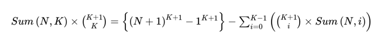

## [백준 1492 - 합](https://www.acmicpc.net/problem/1492)

### 알고리즘
- 수학, 정수론, 조합론
- 다이나믹 프로그래밍
- 모듈러 곱셈 역원(페르마 소정리)

### 풀이
sum(N,K)는 다음과 같은 점화식으로 표현할 수 있다. (https://memoacmicpc.tistory.com/32 블로그를 참고했다.)
  

C(k+1,k)를 나눌 때는 모듈러 곱셈 역원(페르마 소정리)를 이용하여 처리한다.  
주의할 점은 빼기가 있으므로 mod 연산 값이 음수가 될 수 있으니 mod를 한 번 더해준다.

```c++
#include <iostream>
#include <algorithm>
#include <cmath>
#include <utility>
#include <string>
#include <cstring>
#include <vector>
#include <tuple>
#include <stack>
#include <queue>
#include <deque>
#include <list>
#include <map>
#include <unordered_map>
#include <climits>

#define INF 987654321
#define INF2 2147483647
#define all(v) (v).begin(), (v).end()

using namespace std;
using ll = long long;
using pii = pair<int, int>;
using pll = pair<ll, ll>;
using ti3 = tuple<int, int, int>;

const ll mod = 1e9+7;
ll N, K;
ll dp_sum[51], f[52];

ll pow(ll a, ll b, ll c) {
    ll res = 1;
    while(b) {
        if(b%2) res = (res * a) % c;
        a = (a * a) % c;
        b >>= 1;
    }
    return res;
}
void set_factorial() {
    f[0] = 1;
    for(ll i=1; i<=51; i++) f[i] = (i*f[i-1]) % mod;
}
ll C(ll n, ll k) {
    if(k == 0 || k == n) return 1;
    return f[n] * pow(f[k]*f[n-k]%mod, mod-2, mod) % mod;
}
ll sum(ll n, ll k) {
    if(k == 0) return n;
    ll &ret = dp_sum[k];
    if(ret != -1) return ret;
    ret = pow(n+1,k+1,mod) - 1;
    for(int i=0; i<k; i++)
        ret = (ret - C(k+1,i) * sum(n,i)) % mod;
    ret = (ret + mod) % mod;
    ret = (ret * pow(C(k+1,k),mod-2,mod)) % mod;
    return ret;
}

int main(void) {
    ios_base::sync_with_stdio(false);
    cin.tie(nullptr);
    cout.tie(nullptr);

    memset(dp_sum, -1, sizeof dp_sum);
    set_factorial();

    cin >> N >> K;
    cout << sum(N,K) << '\n';

    return 0;
}

```

### 참고
https://memoacmicpc.tistory.com/32