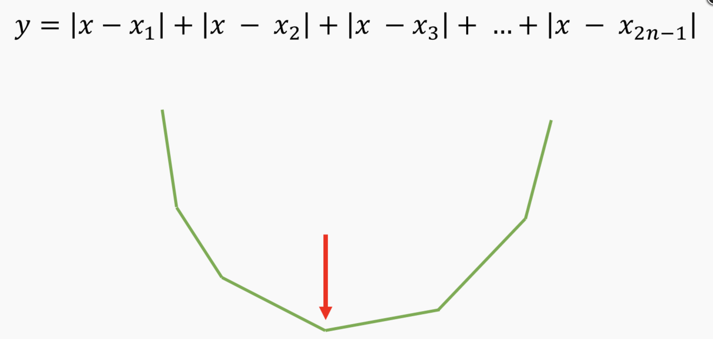
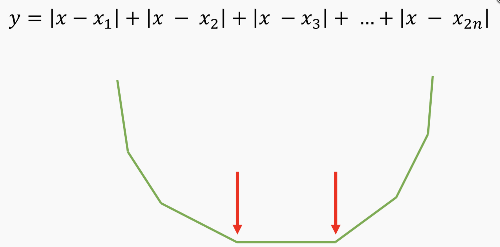

## [백준 1866 - 택배](https://www.acmicpc.net/problem/1866)

### 참고
https://justicehui.github.io/koi/2019/01/15/BOJ1866/

### 알고리즘
- 다이나믹 프로그래밍
- 정렬
- 누적합

### 풀이
차례대로 접근하기 위해 택배들의 위치를 정렬한다.  
dp[i] = (1 ~ i 택배들을 배달했을 때의 최솟값) 이라 하자.  

dp[1 ~ i-1] 까지를 구한 상태에서 dp[i]를 구한다고 하자.  
1. i번째 택배를 트럭으로 이동
2. j(1 <= j <= i)로 헬리콥터로 이동시킨 후에, i까지 트럭으로 이동

위 방식으로 점화식을 세울 수 있다.  
2번 방식을 해결하기 위해서는 한 가지의 아이디어가 더 필요하다.  
연속된 k개의 택배를 헬리콥터로 옮긴 후 트럭으로 이동시킬 때 이 값이 최소가 되기 위해서는 가운데 택배 지점으로 헬리콥터를 운행시켜야 한다.  

홀수 일때는,

짝수 일때는,


이렇게 그래프가 그려지기 때문에 가운데로 이동시켜야 한다.

이때, cost를 구하기 위해 모든 x에 접근하여 구하면 O(n^3)로 시간초과가 난다.  
따라서 가운데 택배를 m이라 할때, m이전 택배들과 이후 택배들을 나눠서 누적합을 이용해 cost를 계산한다.

```c++
#include <iostream>
#include <algorithm>
#include <cmath>
#include <utility>
#include <string>
#include <cstring>
#include <vector>
#include <tuple>
#include <stack>
#include <queue>
#include <deque>
#include <list>
#include <map>
#include <unordered_map>
#include <climits>

#define INF 987654321
#define INF2 2147483647
#define all(v) (v).begin(), (v).end()

using namespace std;
using ll = long long;
using pii = pair<int, int>;
using pll = pair<ll, ll>;
using ti3 = tuple<int, int, int>;

int N;
vector<int> target, dp, psum;
int t, h;

void resize() {
    target.resize(N+1);
    dp.resize(N+1); fill(all(dp), 0);
    psum.resize(N+1); fill(all(psum), 0);
}

int main(void) {
    ios_base::sync_with_stdio(false);
    cin.tie(nullptr);
    cout.tie(nullptr);

    cin >> N;
    resize();
    for(int i=1; i<=N; i++) cin >> target[i];
    sort(all(target));
    for(int i=1; i<=N; i++) psum[i] = psum[i-1] + target[i];
    cin >> t >> h;

    for(int i=1; i<=N; i++) {
        dp[i] = dp[i-1] + target[i]*t;
        // j ~ i
        for(int j=i; j>=1; j--) {
            int m = (i+j)/2;
            int cost = 0;
            cost += (m-j)*target[m] - (psum[m-1]-psum[j-1]); // j ~ m-1
            cost += (psum[i]-psum[m]) - (i-m)*target[m]; //m+1 ~ i
            cost = t*cost + h;
            dp[i] = min(dp[i], dp[j-1] + cost);
        }
    }
    cout << dp[N] << '\n';

    return 0;
}
```