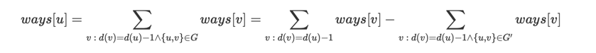

## [atcoder 319-G Counting Shortest Paths](https://atcoder.jp/contests/abc319/tasks/abc319_g)

### 알고리즘
- BFS
- DP

### 풀이
1. BFS를 통해서 dis[v] := 1->v 까지의 거리를 구한다.
2. num[u] := u까지의 최소경로의 number of paths 라 하자.  
   이떄, dis[u]+1 == dis[v]이며 u->v가 존재하는 경우에 대해서 num[v] += num[u]를 다 해주면 결과를 구할 수 있다.

하지만 2번의 경우, $O(N^2)$ 이므로 TLE가 된다.  

이번엔 unvisited vertex를 업데이트하는 방식으로 해결해 보자.  
  
ways[u] := 1->u의 (최단 경로일 때) 가능한 모든 경로의 수  

1. BFS를 통해서 unvisited vertex list(uv)를 계속 업데이트 시켜준다.
   1. 거리 d에서 정점 u를 처음으로(최단 경로로) 방문했다고 하자.
   2. blocked edges(be)를 체크해서 u->v로의 edge가 가능하다면 uv에서 v를 제거해 줄 수 있다. 그리고 다음 dist에서 v를 처음 방문했다고 볼 수 있다.
   3. 1~2과정은 각 정점 u의 be들이 뭐가 있는지 한 번씩만 체크하므로 O(M)이 된다.
2. dp를 통해서 number of paths(num)을 계속 업데이트 시켜준다.
   1. 거리 d에서의 처음 방문 정점들 중 하나를 v라 하자.
   2. num[v] = tot[dis[v]-1] -> 즉, dis[v]-1 거리(바로 이전 거리)에서의 방문 점점들의 모든 num들의 합인 tot[dis[v]-1]을 더해준다.
   3. u -> v 에 대해서 1)unblocked edge이면서, 2)dis[u]+1 == dis\[v\](바로 이전에 방문한 정점)이라면 num[v] -= num[u]를 해준다.
   4. 1~3 과정은 각 정점에 대해서 해당 정점의 be들을 체크하기 떄문에 O(N+M)이 될 것으로 예상된다.
3. num[N]이 정답이 된다.

### 코드
```c++
#include <iostream>
#include <algorithm>
#include <cmath>
#include <utility>
#include <string>
#include <cstring>
#include <vector>
#include <tuple>
#include <stack>
#include <queue>
#include <deque>
#include <list>
#include <map>
#include <unordered_map>
#include <set>
#include <unordered_set>
#include <climits>

#define endl "\n"
#define INF 987654321
#define INF2 2147483647
#define all(v) (v).begin(), (v).end()

using namespace std;
using ll = long long;
using pii = pair<int, int>;
using pll = pair<ll, ll>;
using ti3 = tuple<int, int, int>;

const int mxn = 2e5 + 1, p = 998244353;
int N, M;
vector<int> be[mxn]; // blocked edges
vector<int> vd[mxn]; // vd[d] := vertices in d
vector<int> dis(mxn, 0); // dis[v] := distance of vertex v

vector<int> tot(mxn); // tot[d] := total sum of number of case at distance of d
vector<int> num(mxn); // num[v] := number of case of path from 1 to v


void bfs() {
    queue<int> q; q.emplace(1); // visited vertices at current distance
    queue<int> del;
    set<int> uv; // unvisited vertices
    for(int i=2; i<=N; i++) uv.insert(i);
    vector<bool> blocked(N+1);

    while(!q.empty()) {
        int u = q.front(); q.pop();
        for(int &v : be[u]) blocked[v] = true;
        for(auto v : uv) {
            if(!blocked[v]) {
                del.emplace(v);
                dis[v] = dis[u]+1;
                vd[dis[v]].emplace_back(v);
                q.emplace(v);
            }
        }
        while(!del.empty()) {
            uv.erase(del.front());
            del.pop();
        }
        for(int &v : be[u]) blocked[v] = false;
    }
}

int main(void) {
    ios_base::sync_with_stdio(false);
    cin.tie(nullptr);
    cout.tie(nullptr);

    cin >> N >> M;
    while(M--) {
        int u, v; cin >> u >> v;
        be[u].emplace_back(v);
        be[v].emplace_back(u);
    }

    bfs();
    tot[0] = 1;
    for(int d=1; d<=dis[N]; d++) {
        for(int &v : vd[d]) { // u->v
            num[v] += tot[d-1];
            for(int &u : be[v]) {
                if(dis[u]+1 == dis[v])
                    num[v] = (num[v] - num[u] + p) % p;
            }
            tot[dis[v]] = (tot[dis[v]] + num[v]) % p;
        }
    }
    if(dis[N]) cout << num[N] << endl;
    else cout << -1 << endl;

    return 0;
}
```